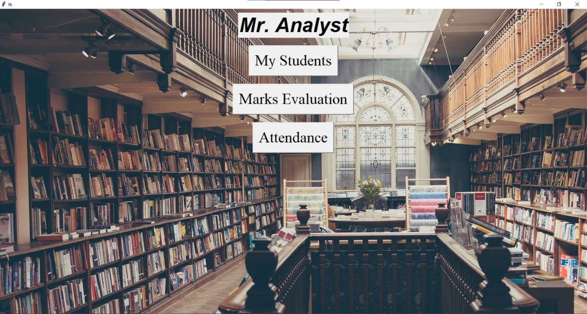
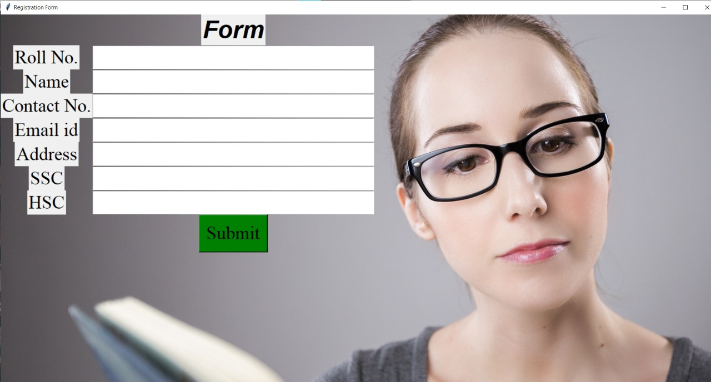
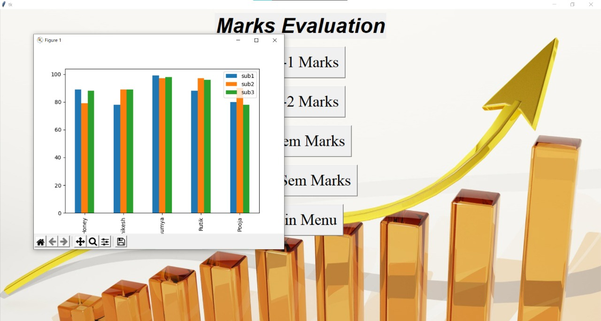

<h1 align="center">Welcome to Mr. Analyst 👋</h1>






> The project, “Mr. Analyst” is a Python based stand-alone application which makes use of TKinter for creation of UI. The project is an examination manager for teachers to save and analyse student's exams with the help of graphs.

### 🏠 [Homepage](https://github.com/HoneyPatre)

## Prerequisites

- python
- matplotlib
- tkinter

## Install

```sh
pycharm
```

## Usage

```sh
run miniproject.py
or
python miniproject.py
```
Side Note: File paths has to be changed according to respective system.

## Author

👤 **Honey Patre**

* Github: [@HoneyPatre](https://github.com/HoneyPatre)
* LinkedIn: [@honey-patre](https://linkedin.com/in/honey-patre-b87591178)
* Youtube: [@honey-patre](https://www.youtube.com/channel/UCVFMjbTF1qmD3YrABDjc40Q)
* Email    :  honeypatre019@gmail.com
